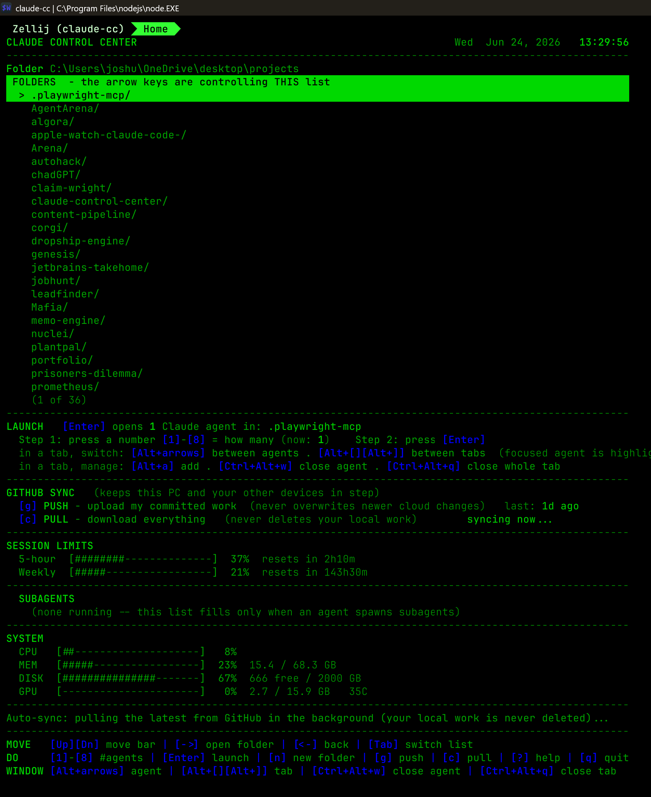
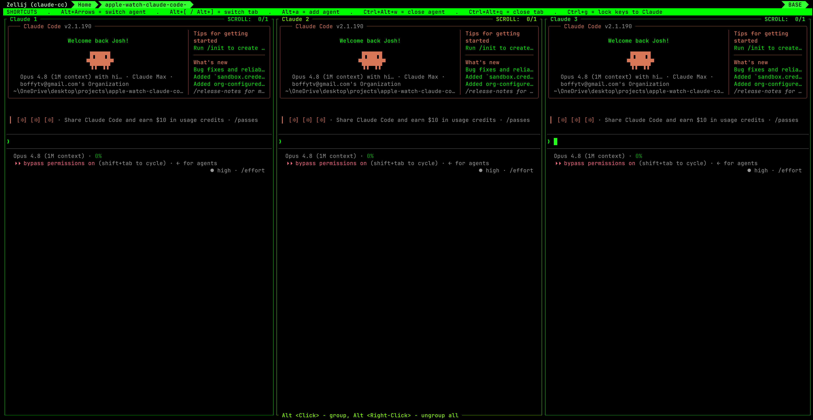

# Claude Control Center

A single tabbed control center for launching and monitoring Claude Code agents,
plus one-button **GitHub sync** to keep all your devices in step.





<sub>Top: the home dashboard — a folder picker that launches 1–8 agents, one-button
GitHub push/pull, live 5-hour and weekly rate-limit gauges, and CPU/MEM/DISK/GPU
stats. Bottom: a single Zellij tab driving three Claude Code agents at once.</sub>

This is the **canonical source** and it lives in your projects folder
(`~/OneDrive/desktop/projects/claude-control-center`) as its own GitHub repo, so
you can edit it, push it, and pull it on any device exactly like any other
project. The app runs **straight from this folder** — no hidden install copy to
keep in sync.

All app code is **Node ESM (`.mjs`), zero npm dependencies** — Node built-ins and
raw ANSI only. Node is guaranteed present (Claude Code requires it). Every script
is **self-locating** (it finds its siblings relative to itself), so the whole
folder can be moved or cloned anywhere and still works.

## Using the dashboard (the basics)

The dashboard always shows a plain-English guide at the top, and a bright
**reversed bar** marks which list the arrow keys are currently driving.

| Key | What it does |
| --- | --- |
| `Up` / `Down` | Move the green highlight bar |
| `Right` | Open the highlighted folder (go into it) |
| `Left` | Go back out to the parent folder |
| `1`–`8` **then** `Enter` | Two steps: press a number to pick how many agents, **then** press Enter to launch them in the highlighted folder |
| `n` | **New folder** — type a name + Enter to create a folder inside the one you're viewing (empty + Enter cancels) |
| `g` | **PUSH** — upload your committed work to GitHub (never overwrites newer cloud changes) |
| `c` | **PULL** — download everything from GitHub (never deletes your local work) |
| `Tab` | Switch the arrows to the Subagents list (only when something is there) |
| `?` | Full-screen plain-English help |
| `q` / `Ctrl+C` | Quit the dashboard (running agents keep going) |

### Inside an agent window (tab)

Each launched tab holds 1–8 Claude instances, each with a titled border
(`Claude 1`, `Claude 2`, …); the one you're typing into is **highlighted**, so you
always know which agent has focus. The green **shortcut bar** pinned at the
**bottom** of every tab lists the keys:

| Key | What it does |
| --- | --- |
| `Alt`+Arrows | Switch which agent is focused (move between the Claude panes) |
| `Alt+[` / `Alt+]` | Switch between tabs (windows) |
| `Alt+a` | Add another Claude agent to this tab |
| `Ctrl+Alt+w` | Close the focused agent |
| `Ctrl+Alt+q` | Close the whole tab (all its agents at once) |
| `Ctrl+g` | Lock keys straight to Claude (so Zellij won't intercept shortcuts) |
| `Alt+i` | Open the subagent monitor (a live status table — what each subagent is doing; not its transcript) |

> The advertised text for all of these shortcuts is generated from a single
> module, [`shortcuts.mjs`](shortcuts.mjs) — the bottom strip and the dashboard
> cheatsheet both read from it, so they can't drift apart. The actual key
> **bindings** live in the `dotfiles` repo's `~/.config/zellij/config.kdl`; keep
> that file's keybinds in sync with `shortcuts.mjs`.

Click the **Home** tab (leftmost) to come back to the dashboard. Casual navigation
never closes an agent — closing is always a deliberate `Ctrl+Alt+w` / `Ctrl+Alt+q`.
Zellij's default mode keys (`Ctrl+h/p/n/t/s/o/b`) are unbound, so ordinary terminal
keys like **Ctrl+Backspace** (delete word) pass straight through to Claude instead
of opening a Zellij overlay.

If a list ever looks "dead", the arrows are simply on the *other* list — the
focus bar tells you which, and the dashboard now refuses to strand the arrows on
an empty Subagents list.

## GitHub sync — what the buttons promise

- **`g` PUSH** runs a plain `git push` on every repo under your projects root.
  Git refuses a non-fast-forward push, so if another device already uploaded
  newer work, yours is **skipped, never overwritten** — pull first, then push.
- **`c` PULL** clones anything missing and **fast-forwards** the rest. A dirty or
  diverged repo is fetched but left alone. Your local commits and uncommitted
  changes are **never discarded**.

Both operate on `~/OneDrive/desktop/projects` and skip the `dotfiles` repo.

## Always-on background sync

**On open (Windows):** launching the control center (Ctrl+Alt+C → the Home tab)
kicks off a **silent, windowless** PULL in the background — same as pressing `c`,
same safety (clone missing + fast-forward, never discards local work). So opening
the dashboard is instant *and* every repo is brought current, with no separate
clone window stealing focus at boot. The SYNC section shows `syncing now...` while
it runs, then the result.

The `g`/`c` buttons are the manual path. For hands-off sync, `sync-daemon.mjs`
does the same thing on a schedule, with **no dashboard open**, and it self-updates
this repo first so the control center keeps itself current across machines:

1. `git pull --ff-only` on this repo (the meta bit — the tool updates itself).
2. Run the freshly-pulled `clone-all.mjs` over the projects folder this repo sits
   in: clone anything new, fast-forward the rest, leave dirty/diverged repos alone.

On macOS it is wired to launchd so it is hardwired into startup and always running:

```sh
bash macos/install-sync-agent.sh      # runs at every login + every 10 min
# CC_SYNC_INTERVAL=300 bash macos/install-sync-agent.sh   # custom interval (seconds)
bash macos/uninstall-sync-agent.sh    # stop + remove (repos/logs untouched)
```

Watch it: `tail -f ~/.claude/state/cc/sync.log`. Each line is one tick, e.g.
`self-update: ok | up-to-date=24 cloned=1 skipped=5`. The full last result is in
`~/.claude/state/cc/sync-last.json`.

## Files

| File | Role |
| --- | --- |
| `install.mjs` | **Deploys `workspace/` config to the OS paths** each tool reads from (cross-platform, with `.pre-install.bak` backups). Replaces chezmoi. Run `node install.mjs` after `git pull` on any machine. |
| `workspace/` | **All machine config in one place** (zellij, WezTerm, Claude global settings/CLAUDE.md/commands, helix, espanso, hammerspoon, Windows launcher). See [`workspace/README.md`](workspace/README.md). |
| `home.mjs` | **Home TUI** — folder navigator, agent-count picker, launch, GitHub push/pull, live 5h/Weekly limit gauges, subagents list + monitor, help overlay. |
| `shortcuts.mjs` | **Single source of truth** for advertised shortcut text. `cheatsheet.mjs` and `home.mjs` both render from it. |
| `statusline.mjs` | statusLine for `~/.claude/settings.json`. Prints `model · ctx% · task` and writes `agents/<sessionId>.json`. |
| `inspector.mjs` | Live subagent **monitor** — a 1s-refresh status table (type/label/last tool/elapsed) per subagent, opened in a Zellij floating pane. Shows metadata, not transcripts. |
| `git-push-all.mjs` | `node git-push-all.mjs <root>` → pushes repos under `<root>` (excludes `dotfiles`), prints JSON. Never force-pushes. |
| `clone-all.mjs` | `node clone-all.mjs <root>` → clones missing + `--ff-only` pulls all your GitHub repos. Finds clones **one level deep too** (e.g. `other/algora`) and updates them in place instead of re-cloning a top-level duplicate. Never discards local work. |
| `sync-daemon.mjs` | **Always-on background sync.** Self-updates this repo (`git pull --ff-only`), then runs `clone-all.mjs` over the projects folder it lives in. Run on a schedule by the macOS LaunchAgent. Logs to `~/.claude/state/cc/sync.log`. |
| `macos/install-sync-agent.sh` | Installs `sync-daemon.mjs` as a LaunchAgent that runs at login and every 10 min. `macos/uninstall-sync-agent.sh` removes it. |
| `hintbar.mjs` | A subtle dim one-row footnote at the bottom of each agent window: `Press Alt+S for keyboard shortcuts`. |
| `cheatsheet.mjs` | The `Alt+S` overlay (floating pane): the **complete** shortcut list in plain English, grouped by context and sub-section. Renders from `shortcuts.mjs`. `Alt+S` **toggles** it (press again to close — it won't stack); any other key closes it too. |
| `hooks/session-register.mjs` | SessionStart/SessionEnd hook: maintains `panes/<id>` and cleans up state. |
| `hooks/subagent-track.mjs` | Subagent/tool hooks: maintains `subagents/<parent>/<agentId>.json`. |
| _(agent-tab layouts)_ | Generated by `home.mjs` at launch — no static files. The N agents are tiled into a balanced grid sized to the **current window** so panes come out as square as possible (stacked rows on a portrait monitor, side-by-side columns on a landscape one). |
| `workspace/zellij/layouts/cc-default.kdl` | The Home-tab session layout; `install.mjs` deploys it to `~/.config/zellij/layouts/`. |

## How it is wired into the machine

Everything lives in **this one repo** now. The machine config (zellij, WezTerm,
Claude global settings, helix, espanso, the OS launcher) is in [`workspace/`](workspace/),
and **`install.mjs`** copies each file to the OS path its tool reads from. There is
no separate dotfiles repo and no chezmoi any more.

Sync a machine in two commands:

```sh
git pull                # this repo
node install.mjs        # deploy workspace/ config to the OS paths (Windows or macOS)
```

`install.mjs` self-locates, fills in per-OS paths/tokens, and backs up anything it
overwrites to `<file>.pre-install.bak`. See [`workspace/README.md`](workspace/README.md)
for the full map of what goes where. The deployed config points back at this folder
(e.g. zellij runs `home.mjs`/`inspector.mjs` from here; `~/.claude/settings.json`
runs `statusline.mjs` + `hooks/` via `~/.local/share/claude-cc/`).

## Shared state

State root: `~/.claude/state/cc/` (each component creates it).

- `agents/<sessionId>.json` — per-agent status incl. `rateLimits` and `paneId`
  (readers ignore entries older than 120 s).
- `panes/<ZELLIJ_PANE_ID>` — plain text = the `sessionId` running in that pane.
- `subagents/<parentSessionId>/<agentId>.json` — per-subagent status.
- `gen/claude-N.kdl` — the agent-tab layout `home.mjs` generates for the current
  window at launch (orientation-aware grid), then hands to `zellij action new-tab`.

## Run / test directly

```sh
node home.mjs                       # uses the default projects dir
CC_ROOT=/path/to/dir node home.mjs  # override the start directory
```

Requires an interactive terminal (TTY). Launch shells out to
`zellij action new-tab --layout <gen>/claude-<N>.kdl --cwd <dir> --name <basename>`;
if `zellij` is not on `PATH`, an inline error is shown — Home never crashes.
